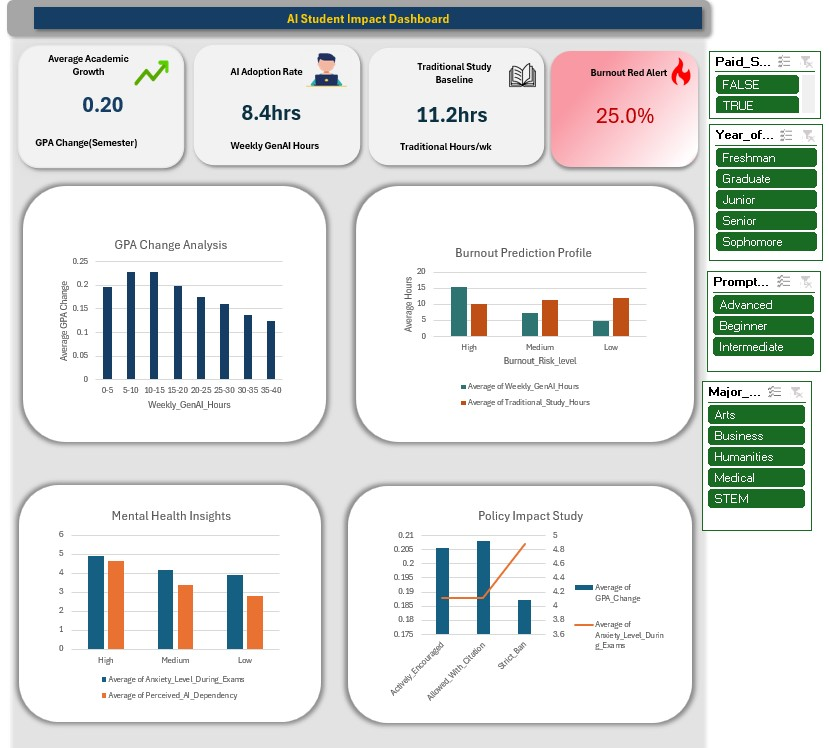

# 🤖 Generative AI Impact on Students — Power BI Dashboard

An interactive Power BI dashboard analyzing student engagement, study habit changes, academic growth, and burnout risks associated with Generative AI adoption in higher education.

## 📌 Project Overview
This project evaluates survey and behavioral data from students to uncover how AI integration alters traditional study hours, academic outcomes, and mental fatigue. The goal is to provide decision-makers and educators with actionable insights into responsible AI deployment in academic environments.

*Business Objective:* Measure the impact of Generative AI tools on student study efficiency, academic performance trends, and burnout risks across academic disciplines.

## 🎯 Key KPIs
* **AI Adoption Rate** — Average weekly hours spent utilizing Generative AI tools for coursework.
* **Traditional Study Baseline** — Average weekly hours spent studying without AI assistance.
* **Average Academic Growth** — Net GPA score adjustments and performance improvements across student demographics.
* **Burnout Red Alerts** — Threshold indicators highlighting students with high study hours and elevated burnout levels.

* ## 📊 Dashboards

### 1. Overview Analysis
* Dynamic **Measure Selector** (disconnected table) to switch views between AI Adoption Rate, Traditional Study Hours, and Academic Performance.
* Demographic breakdown across **Gender**, **Department**, and **Academic Year**.
* Dynamic visual headers that update automatically based on the selected metric.
* Global filters for filtering across departments and academic programs.
* Summary visual highlighting high-risk burnout patterns across study intensity groups.

### 2. Time Analysis
* Visual comparison of study hours dedicated to AI vs. traditional methods across weekdays and weekends.
* Weekly distribution chart tracking study intensity changes throughout the term.

### 3. Details Tab
* Granular records matrix providing student-level survey details.
* Drill-through configuration for localized department-level analysis.

## 🛠️ Tools & Techniques Used
* **Power BI** — Data modeling, DAX measures, custom visual design.
* **Disconnected Tables** — Used for dynamic metric selection and visual switching.
* **Bookmarks & Buttons** — Interactive UX elements including view toggles and filter resets.
* **Conditional Formatting** — Used to flag burnout alerts and top-performing segments.

## 📷 Screenshots

## 🚀 Key Insights & Outcomes
* Identified critical balances between AI usage and traditional self-directed study hours.
* Highlighted academic growth trends across different departments adopting AI tools.
* Uncovered key patterns linking excessive study workloads to burnout indicators.

## 📬 Contact
Built by **Barnabas Nart** — Data Analyst  
Feel free to connect or reach out with feedback!
